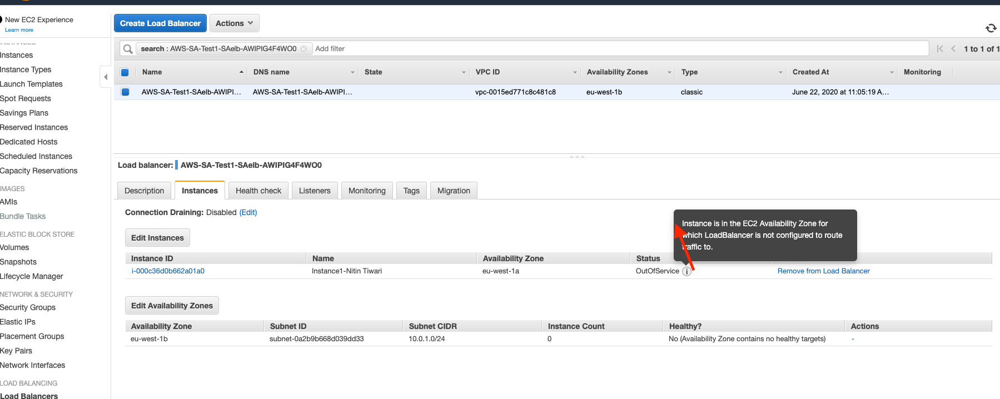
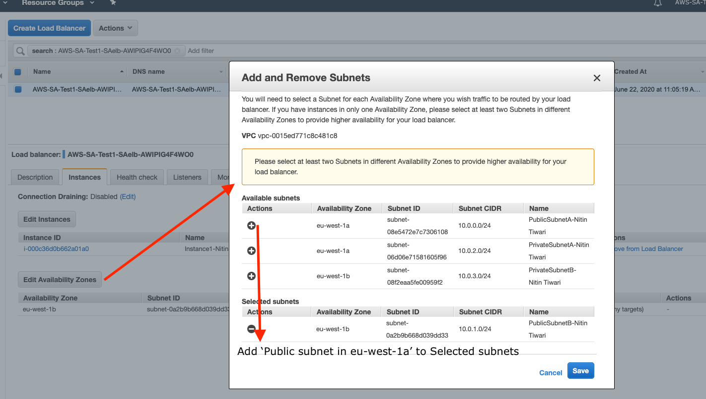
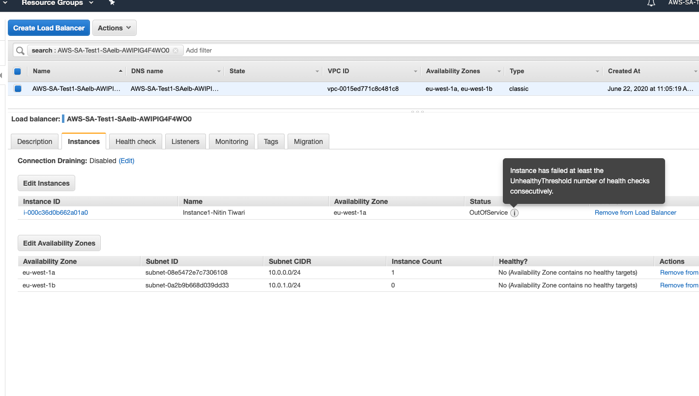
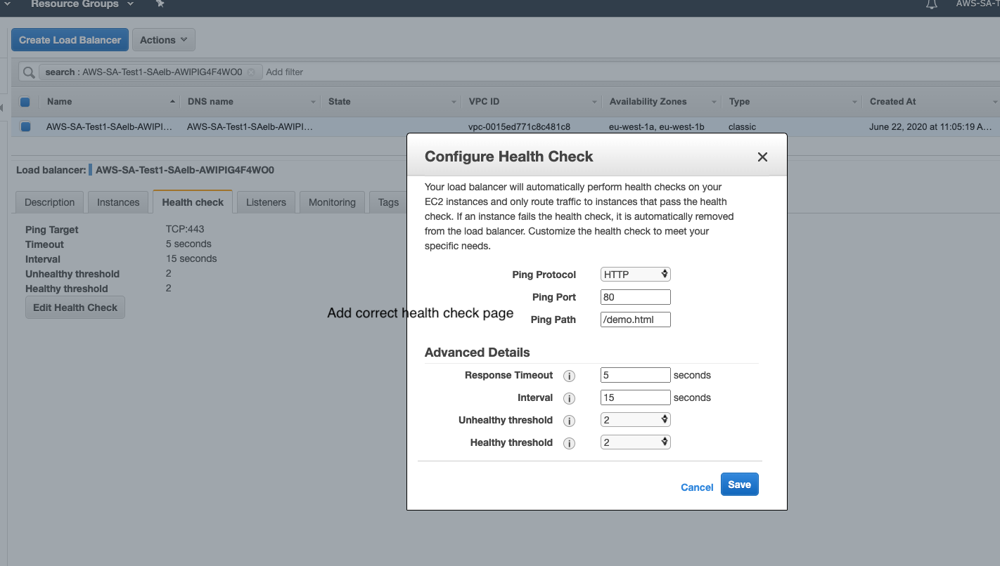
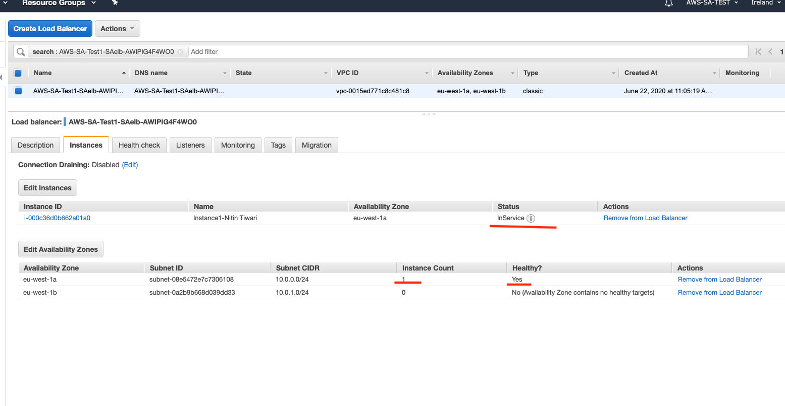
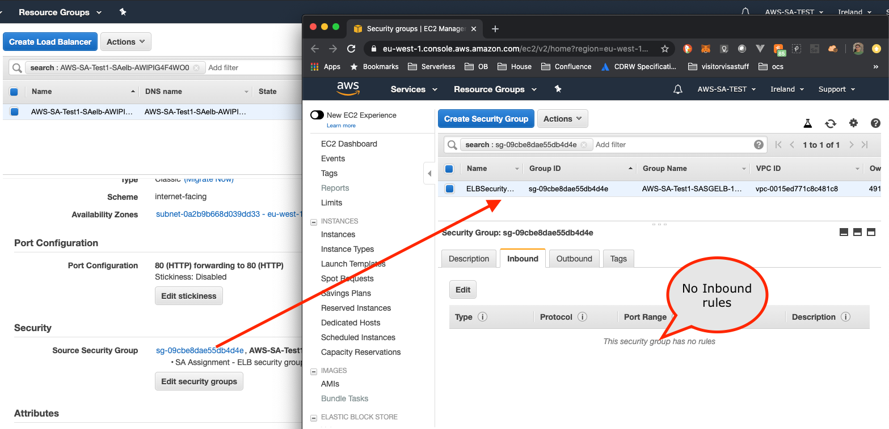
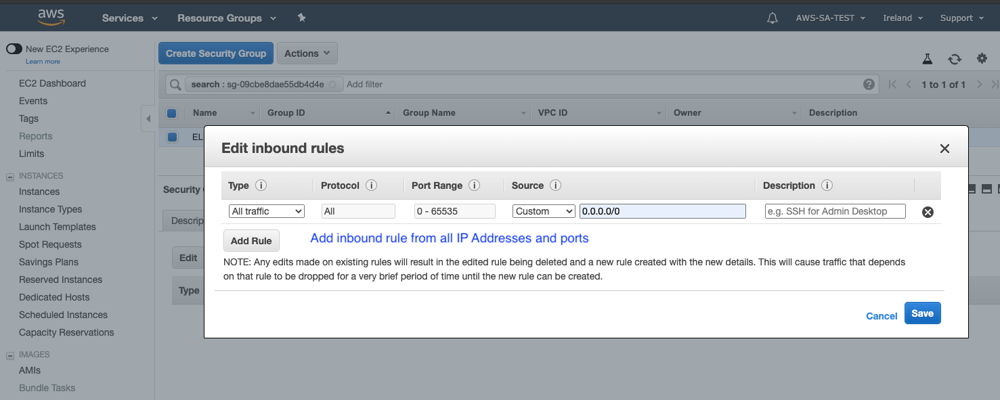
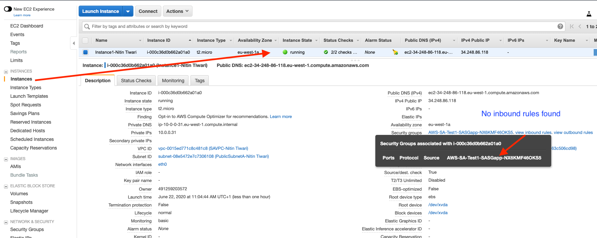
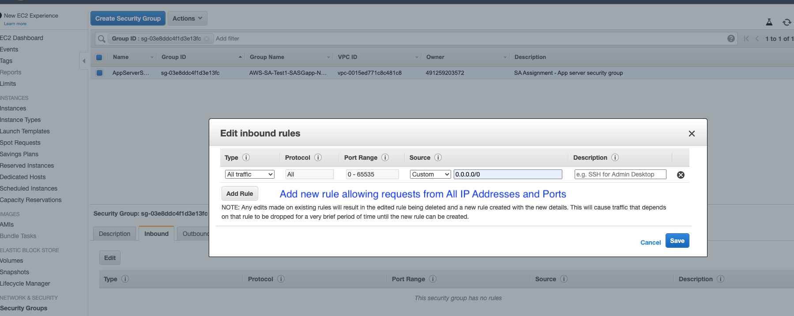
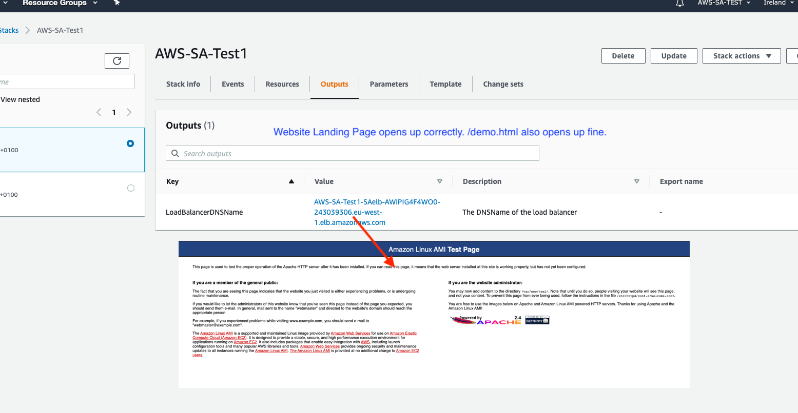

# Solution for the Hiring Assignment

**_By_**
**_Nitin Tiwari_**

- [Solution for the Hiring Assignment](#solution-for-the-hiring-assignment)
  - [Overview](#overview)
  - [Objective](#objective)
  - [Solution for Objective a](#solution-for-objective-a)
    - [Problem - 1](#problem---1)
    - [Problem - 2](#problem---2)
    - [Problem - 3](#problem---3)
    - [Problem - 4](#problem---4)
    - [Summary](#summary)

## Overview

This document describes the solution to the problem statement specified in the [AWS EMEA Solutions Architect Hiring Assignmnet](./SA%20assignment%2020190724.pdf).

Customer has provided a [cloudformation template](./template-src/AWS-SA-CloudFormation-v20190724.yaml) for the configuration they created with their current level of AWS Knowledge. Configuration is faulty and the website is not loading.

## Objective

Requirement is broken down to three deliverables:

a) Troubleshoot the implementation by doing the minimum amount of work required to make the web site operational. Your customer expects detailed written troubleshooting instructions or scripts for the in-house team.

b) Propose short term changes you could help them implement to improve the availability, security, reliability, cost and performance before the project goes into production. Your customer expects you to explain the business and technical benefits of your proposals, with artifacts such as a design or architecture document and diagrams.

c) Optionally, propose high level alternative solution(s) for the longer term as their web application becomes more successful.

## Approach for Objective a

a) Troubleshooting steps executed for the current proof of concept:

- Cloud formation template was laucnhed in the AWS, a stack is created
- As suggested in the problem statement, the loadbalancer link did not render the expected webpage.
- In such a case the first point to look is whether the Load Balancer is configured correctly, and routing correctly defined.

### Problem - 1

On inspection we found that the instance attached doesn't match the Availability Zones configured for the Load Balancer.



**Solition**: Add the same AZ, instance is available in.



- After doing the change above, we found the error on the Instance Status changed to Health Check configuration problem.

### Problem - 2

Load Balancer fails Health Check, it refers to TCP:443, while instance isn't configured on port 443, used commonly for secured HTTP connection.



**Solution**: Update the health check page, as below:



- This step resolves the Instance configuration service, however the website still doesn't load.



Next step is to check the Security group configurations.

### Problem - 3

On inspection we found that Security group for Load balancer was not configured to allow Inbound traffic.



**Solution**: Add a new inbound rule to allow incoming traffic from All IP and Ports.



- Next step is to check the rules for the EC2 instance and same problem as above was encountered - No inbound traffic rule was found

### Problem - 4

Instance doesn't allow inbound requests.



**Solution**: Add a new inbound rule to allow incoming traffic from All IP and Ports.



At this stage, the website starts to load correctly.



### Summary

To fix the problems customer is facing to launch their website can be resolved by doing following changes to Cloudformation Template:

1) New ELB Configuration with correct subnet,and healthcheck page;

```
SAelb:
      Type: AWS::ElasticLoadBalancing::LoadBalancer
      Properties:
        Subnets: [!Ref 'PublicSubnetA']
        Instances: [!Ref 'SAInstance1']
        SecurityGroups: [!Ref 'SASGELB']
        Listeners:
        - LoadBalancerPort: '80'
          InstancePort: '80'
          Protocol: HTTP
        HealthCheck:
          HealthyThreshold: '2'
          Interval: '15'
          Target: HTTP:80/demo.html
          Timeout: '5'
          UnhealthyThreshold: '2'
        Tags:
          - Key: environment
            Value: sa-assignment
          - Key: Name
            Value: !Join ['-', [ELB, !Ref 'CandidateName']]
```

2) Add Inbound traffic rule for Load Balancer

```
SASGELBINGRESS:
    Type: AWS::EC2::SecurityGroupIngress
    Properties: 
    CidrIp: 0.0.0.0/0
    Description: Inbound rule
    FromPort: '-1'
    GroupId: !GetAtt SASGELB.GroupId
    IpProtocol: '-1'
    ToPort: 80
```

3) Add Inbound traffic rule for the EC2 Instance

```
    SASGAPPINGRESS:
      Type: AWS::EC2::SecurityGroupIngress
      Properties: 
        CidrIp: 0.0.0.0/0
        Description: Inbound rule
        FromPort: '-1'
        GroupId: !GetAtt SASGapp.GroupId
        IpProtocol: '-1'
        ToPort: 80
```

Final cloudformation template with above resolutions can be found [here](./template-fixed/AWS-SA-CloudFormation-v20190724.yaml).

## Approach for Objective b

Proposal for short term changes to help the customer improve the availability, security, reliability, cost and performance before the project goes into production can be find in a separate document below.

[Short Term Approach for Production Readiness](./objective-b.md)