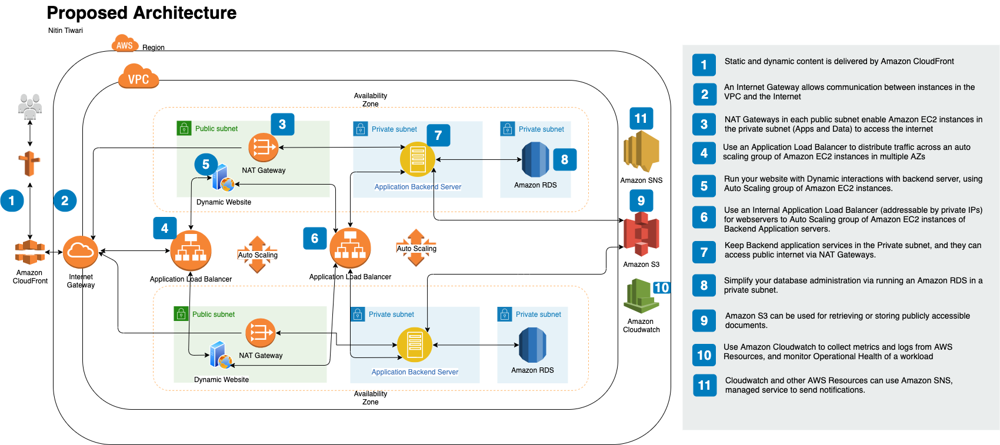

# Short Term Solution

- [Short Term Solution](#short-term-solution)
  - [Overview](#overview)
  - [Approach](#approach)
    - [Proposed High Level Architecture](#proposed-high-level-architecture)
    - [Technical Solution Brief](#technical-solution-brief)
  - [Deployment Best Practice](#deployment-best-practice)
  - [Alignment with AWS Well-Architected Framework](#alignment-with-aws-well-architected-framework)
    - [Operational Excellence](#operational-excellence)
    - [Security](#security)
    - [Reliability](#reliability)
    - [Performance Efficiency](#performance-efficiency)
    - [Cost Optimization](#cost-optimization)

## Overview

This document describes the changes that must be applied in short term to make the system Priduction Ready, and provide Avaulability, Security, Cost & Performance.

## Approach

### Proposed High Level Architecture

### Technical Solution Brief

* Solution proposes a clear separation of various components of an application. With the current knowledge of Customer's future requirements, I propose provisioning of 2 AWS Availability zones. 

* Each with 1 Public Subnet and 2 Private Subnets.
This ensures the Networl lebel Security of the protected resources, like core backend application, and database(s).

* Provision AWS Route 53 for DNS Resolution of the publicly available resources, i.e. static Ibsite and content.

* I propose usage of Amazon CloudFront for static content delivery.

* Public subnet(s) host a web server for static and dynamic content, fronted by an Amazon Load Balancer in auto scaling group to facilitate performance in the peak loads.
Restrict the Webservers accessible only via Load Balancer.

* Public Subnet(s) also host a NAT Gateway to enable instances in a private subnet to connect to the internet or other AWS services, but prevent the internet from initiating a connection with those instances.

* I propose setting up an Internal Elastic Load Balancer for Application backend server access, again in an Auto Scaling group and servers accessible via Load Balancers only.

* Solution also includes 3 more services:

  - Amazon S3 - Amazon Simple Storage Service (Amazon S3) is an object storage service that offers industry-leading scalability, data availability, security, and performance. This service must be used for storage of any pubicly accessible document.

  - Amzon Cloudwatch - it is a monitoring and observability service, it collects monitoring and operational data in the form of logs, metrics, and events, providing you with a unified view of AWS resources, applications, and services that run on AWS and on-premises servers.

  - Amazon SNS - primarly used for notifications, email or sms etc.

## Deployment Best Practice

All of the above configuration shall be built via Cloudformation template, to be able to define the whole infrastructure as code. This gives us flexibility to replicate the same environment or setup in another AWS region programmatically in future.

## Alignment with AWS Well-Architected Framework

Solution adheres to the following AWS Well-Architected framework and the document later describes how these princples are met with the proposed design:

- Operational Excellence
- Security
- Reliability
- Performance Efficiency
- Cost Optimization

### Operational Excellence

Provisioning of Amazon Cloudwatch, Auto scaling, AWS managed services for Database like RDS and Notification enables the sustem to run and deliover business value and continually improve supporting processes and proecedures.

### Security

- Solution must enure secure connection to the Webservers only allowing traffic on http. This would involve certificate management, Route 53 DNS configuration, and enabling Load Balancer listener to listen to only https incoming traffic, and deny others.
- Provision IAM (Identity and Access Management)policy for credentials and authentication mechanism.
- Provision controls to capture and analyze logs and events, to secure from unauthorize access, or threats.
- Provision of public and private subnets and corresponding Access Control Layer protects the network.
- Security groups protects EC2 instances

### Reliability

- Establish Auto scaling policies to scale the availability of instances to serve requests reliably according to demand.
- Configuring the Amazon CloudWatch to monitor runtime metrics, and aggregate logs.
- Use of Amazon S3 for backups.

### Performance Efficiency

- Solution is based on the brief knowledge of Customer requirements, however it can be improved for performance, with more clarity on Compute, and Storage requirements.
- For example, AWS Lambda can be suggested in the solution for some of the Business functions to oprimize resource utilization and eventurally provide better perfiornabce.
  
### Cost Optimization

- Using managed services, you can reduce or
remove much of your administrative and operational overhead, freeing you to work on applications and business-related activities.
- Be expenditure aware using AWS Cost Eplorer, and AWS Budgets that notify you if your usage or spend exceeds actual or forecast budgeted amounts.
- Optimize resources over time.

